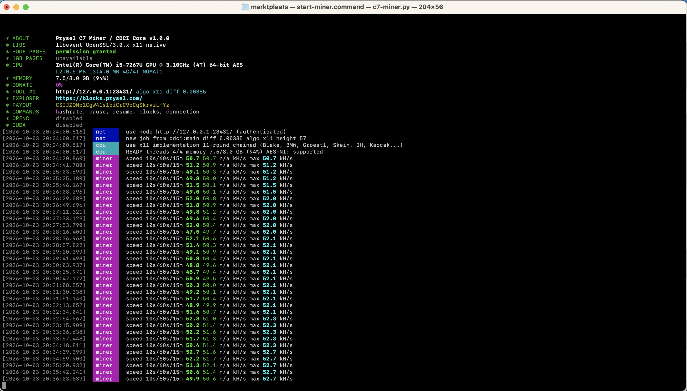
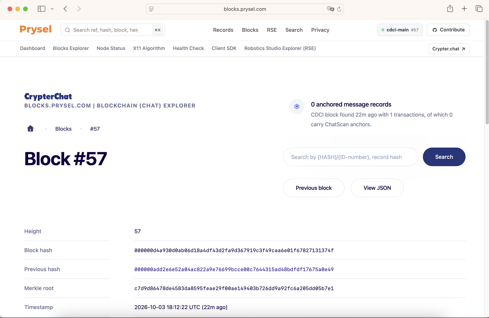

# Prysel C7 Miner (`c7-minerd`)

[](https://blocks.prysel.com/)
[](https://blocks.prysel.com/)
[](https://blocks.prysel.com/)
[](LICENSE)

High-performance, terminal miner, block validator, and on-chain anchor controller for the **CentralDataBase C7 (CDCI)** blockchain and [Prysel Block Explorer](https://blocks.prysel.com/).

---

## 📸 Screenshots

### 1. Terminal Miner Dashboard (`c7-miner.py`)
Featuring classic deep black background, real-time XMRig ANSI telemetry, 10s/60s/15m hashrate tracking, network diff updates, and real-time block discovery notification:



### 2. Live Explorer Confirmation (`https://blocks.prysel.com/`)
Blocks mined with `c7-minerd` immediately secure the network, mint coinbase block rewards, and confirm pending on-chain message anchors:



---

## ⚡ Overview & Features

`c7-minerd` bridges native CentralDataBase consensus with a modern console experience:

- **🖥️ XMRig-Style Terminal UI**: Clean dark-mode console layout with realtime CPU detection, colored log indicators (`INFO`, `CPU`, `NET`, `BLOCK`), and rolling hashrate calculation.
- **⛏️ Native X11 Proof-of-Work**: Calls authoritative node consensus (`generatetoaddress`) using official X11 hashing routines, block assembling, and difficulty verification.
- **🔄 Live Explorer Synchronization**: Continuously compares local node height and mempool state against the public [Prysel Block Explorer](https://blocks.prysel.com/).
- **⛓️ On-Chain Settlement & Anchoring**: Solves pending blockchain hashes and anchors external app data (such as encrypted messaging anchors from CrypterChat) into verified immutable blocks.
- **💻 Cross-Platform Ready**: Double-clickable on Windows (`run.bat` / `start-miner.bat`), macOS (`run.sh` / `start-miner.command`), and Linux.
- **🐳 Dockerized Deployment**: Complete isolated container stack including local `centraldatabased` node and worker container.

---

## 🚀 Quick Start

### 1. Prerequisites
- **Python 3.8+** (with `requests` library)
- Running **CentralDataBase (C7) node** RPC endpoint (Default: `127.0.0.1:13431`)
- Valid **C7 Wallet Address** (e.g. `CSJJZQNp1CgW41s1biCrC9bCqSkrvzLHYz` or `CGZCSzBowAqgHcXPtMT3vs7ycp8hLi5UAD`)

### 2. Setup Configuration
Clone the repository and copy the example environment configuration:

```bash
git clone https://github.com/EricksonAtHome/c7-minerd.git
cd c7-minerd
cp config.example.env .env
```

Edit `.env` with your preferred payout address and RPC credentials:

```ini
RPC_URL=http://Internet-Protocol-address
RPC_USER=c7miner
RPC_PASSWORD=your_secure_password
MINER_ADDRESS=CSJJZQNp1CgW41s1biCrC9bCqSkrvzLHYz
MAX_TRIES=1000000
EXPLORER_URL=https://blocks.prysel.com/
```

### 3. Launching the Miner

#### On Windows:
Double-click `run.bat` or open `cmd.exe`:
```cmd
run.bat
```

#### On macOS:
Double-click `start-miner.command` in Finder, or in Terminal:
```bash
./run.sh
```

#### On Linux:
```bash
chmod +x run.sh c7-minerd.sh
./run.sh
```

---

## ⚙️ Configuration Reference

| Parameter | Default | Description |
|---|---|---|
| `RPC_URL` | `http://Internet-Protocol-address` | CentralDataBase CDCI node JSON-RPC endpoint. |
| `RPC_USER` | `c7miner` | JSON-RPC basic authentication username. |
| `RPC_PASSWORD` | `change-me` | JSON-RPC basic authentication password. |
| `RPC_COOKIE` | *(optional)* | Path to `.cookie` file (overrides user/pass if present). |
| `MINER_ADDRESS` | *(required)* | Valid C7 Base58 address to receive 3.125 C7 block rewards. |
| `MAX_TRIES` | `1000000` | Nonce iterations per RPC mining round. |
| `BLOCKS_PER_CALL` | `1` | Number of blocks to target per mining cycle. |
| `SLEEP_SECONDS` | `1` | Cooldown interval between mining cycles. |
| `EXPLORER_URL` | `https://blocks.prysel.com/` | Public explorer API used for health and state checks. |

---

## 🔗 Architecture & On-Chain Anchoring

```
┌────────────────────────┐         ┌────────────────────────┐
│     CrypterChat        │         │   c7-minerd Worker     │
│   (Encrypted Chat)     │         │   (X11 Proof-of-Work)  │
└───────────┬────────────┘         └───────────┬────────────┘
            │ Message Hash                     │ Solves PoW
            ▼                                  ▼
┌───────────────────────────────────────────────────────────┐
│               CentralDataBase CDCI Core Node              │
│                (X11 / RPC Port 13431)                     │
│  - Assemble Block Template                                │
│  - Packages Pending Mempool Anchors (OP_RETURN)           │
│  - Validates Nonce & CheckProofOfWork()                   │
└───────────────────────────┬───────────────────────────────┘
                            │ Broadcasts Block
                            ▼
┌───────────────────────────────────────────────────────────┐
│            Prysel Explorer (blocks.prysel.com)            │
│       Mined Height + Reward Paid + Anchors Confirmed      │
└───────────────────────────────────────────────────────────┘
```

When applications like **CrypterChat** submit cryptographic digests to the blockchain mempool, `c7-minerd` solves the cryptographic puzzle, packages the pending records into the next block, and seals them permanently on-chain.

---

## 🐳 Docker Support

To run both a full CentralDataBase daemon and the automated miner in isolated containers:

```bash
# Build and start services in background
docker compose -f docker/docker-compose.yml up -d --build

# Follow miner logs in real-time
docker compose -f docker/docker-compose.yml logs -f c7-minerd

# Run one-off explorer verification
docker compose -f docker/docker-compose.yml exec c7-minerd check-blocks
```

---

## 📄 License
MIT License. Built for the **CentralDataBase (C7) / Prysel** Ecosystem.
